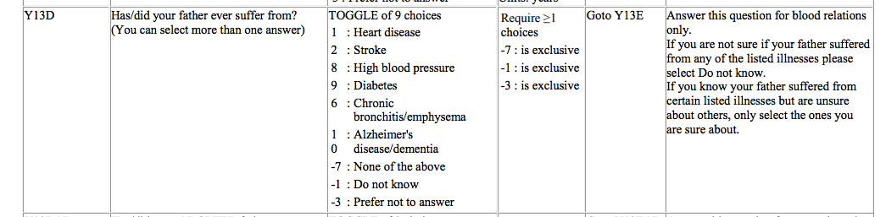
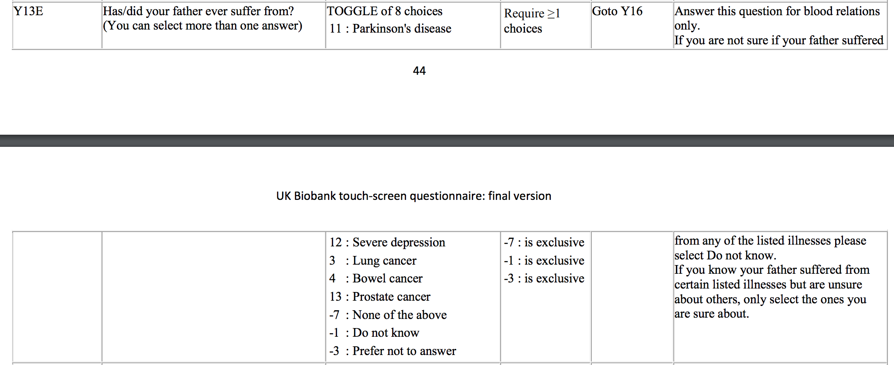
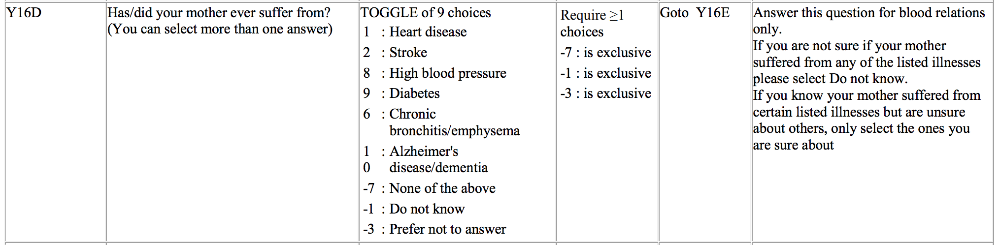
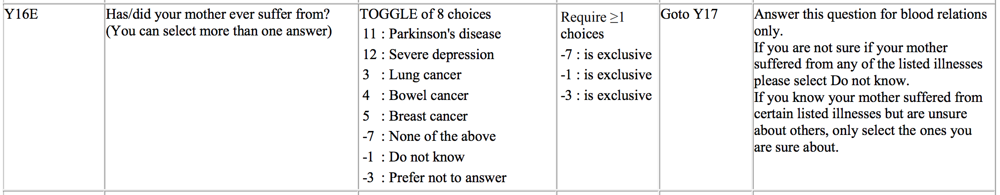
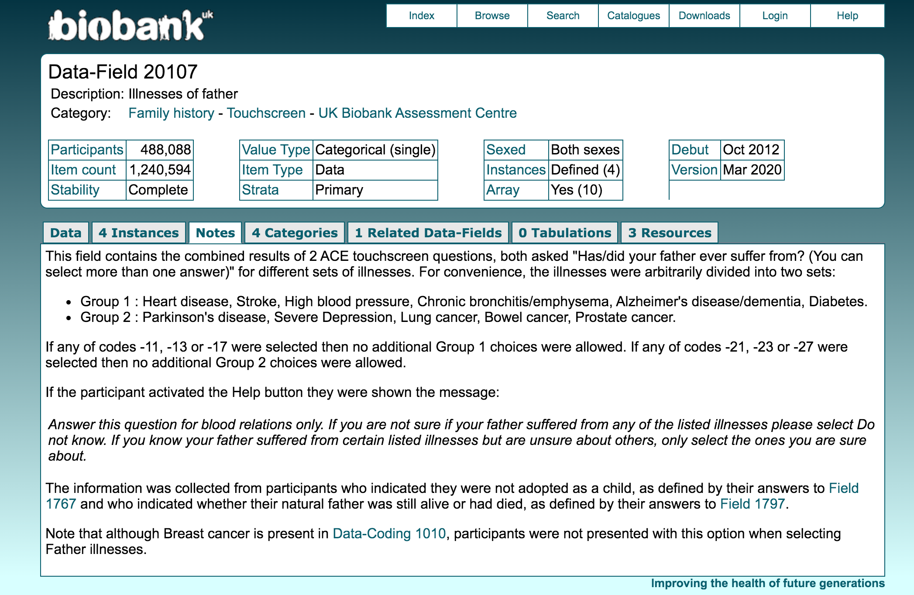

```{r setup}
rm(list = ls())
library(pander)
panderOptions('table.split.table', Inf)
library(ggplot2)
library(dplyr)
library(data.table)
options(datatable.fread.datatable = FALSE)
theme_set(theme_bw(base_size=15))
set.seed(2020)

# load some gists
source('https://gist.githubusercontent.com/liangyy/43912b3ecab5d10c89f9d4b2669871c9/raw/3ca651cfa53ffccb8422f432561138a46e93710f/my_ggplot_theme.R')

# load dependent scripts
source('../code/rlib_misc.R')
```

# About

Here we look into parent illness information in UK Biobank. 
As designed, we limit our scope to **Europeans**.
The parent illness phenotypes were queried by Owen and the data is at `/vol/bmd/meliao/data/2020-04-10_parent-illness.tar.gz`.
We also load the self-reported ancestry (after QC) processed by script at [here](https://github.com/liangyy/ptrs-ukb/blob/master/scripts/construct_phenotype_table/construct_phenotype_table.sh) and the resulting table is at `/vol/bmd/yanyul/GitHub/ptrs-ukb/output/query_phenotypes_cleaned_up.csv`.

To interpret the phenotype, we should refer to the document [here](http://biobank.ndph.ox.ac.uk/showcase/showcase/docs/TouchscreenQuestionsMainFinal.pdf) which is the questionnaire used to collect these data. 
For our purpose, as stated in the "Notes" tab of [Data-Field 20107](http://biobank.ndph.ox.ac.uk/showcase/field.cgi?id=20107), we need to look at questions:

* "Y13D" and "Y13E" for father illness;
* "Y16D" and "Y16E" for mother illness.

For the sake of convenience, I screenshot these questions as below.






Additionally, the "-1, -3, -7" choice are actually coded as "-11, -13, -17" for group 1 and "-21, -23, -27" for group 2 according to the "Notes" tab as shown below. 



# Digitalize the questions

```{r digit}
y13d = data.frame(
  code = c(1, 2, 8, 9, 6, 10, -17, -11, -13),
  choice = c('Heart disease', 'Stroke', 'High blood pressure', 'Diabetes', 'Chronic bronchitis/emphysema', 'Alzheimer\'s disease/dementia', 'None of the above', 'Do not know', 'Prefer not to answer')
)
y13e = data.frame(
  code = c(11, 12, 3, 4, 13, -27, -21, -23),
  choice = c('Parkinson\'s disease', 'Severe depression', 'Lung cancer', 'Bowel cancer', 'Prostate cancer', 'None of the above', 'Do not know', 'Prefer not to answer')
)
y16d = data.frame(
  code = c(1, 2, 8, 9, 6, 10, -17, -11, -13),
  choice = c('Heart disease', 'Stroke', 'High blood pressure', 'Diabetes', 'Chronic bronchitis/emphysema', 'Alzheimer\'s disease/dementia', 'None of the above', 'Do not know', 'Prefer not to answer')
)
y16e = data.frame(
  code = c(11, 12, 3, 4, 5, -27, -21, -23),
  choice = c('Parkinson\'s disease', 'Severe depression', 'Lung cancer', 'Bowel cancer', 'Breast cancer', 'None of the above', 'Do not know', 'Prefer not to answer')
)
code = list()
code[['father']] = rbind(
  y13d %>% mutate(grp = 1),
  y13e %>% mutate(grp = 2)
) %>% distinct() %>% mutate(choice_w_grp = paste0(choice, ' (', grp, ')'))
code[['mother']] = rbind(
  y16d %>% mutate(grp = 1),
  y16e %>% mutate(grp = 2)
) %>% distinct() %>% mutate(choice_w_grp = paste0(choice, ' (', grp, ')'))
```

# Load data

```{r load}
df = list()
df[['father']] = fread('/Users/yanyul/Desktop/tmp/parent_illness/father_illness.csv', sep = ',')
df[['mother']] = fread('/Users/yanyul/Desktop/tmp/parent_illness/mother_illness.csv', sep = ',')
df_pheno = fread('/Users/yanyul/Documents/repo/github/ptrs-ukb/output/query_phenotypes_cleaned_up.csv', sep = ',')

# remove individuals with all columns being NA
for(i in names(df)) {
  df[[i]] = df[[i]][rowSums(!is.na(df[[i]])) > 0, ]
}

# label with self reported ancestry
# only individuals passing ancestry QC and phenotype QC in ptrs-ukb are labeled
ancestry = list()
for(i in names(df)) {
  ancestry[[i]] = df[[i]] %>% left_join(df_pheno %>% select(eid, meaning), by = 'eid') %>% pull(meaning)
}
```

# Process the choice code into individual x phenotype table

Each row is an individual. 
The questionnaire is a multiple choice question so that there are N columns recording everthing being selected.
To extract the information we want, we unfold the raw data frame into individual-by-choice where each entry indicates the number of occurrence of one choice in the row.
In principle, the occurrence should be either 0 or 1. 

**Perform un-folding**

```{r unfold}
df_unfold = list()
for(i in names(df)) {
  df_unfold[[i]] = unfold_parent_illness_code(df[[i]][, -1], code[[i]]$code, code[[i]]$choice_w_grp)
}
```

Sanity check: **Are occurrences all 0 or 1?**

```{r check}
for(i in names(df_unfold)) {
  message('In ', i, ' illness, # entry (the occurrence) > 1 = ', sum(df_unfold[[i]] > 1))
}
```

Next, we need to refine the zero's in the table. 
The zeros could be:

* "no disease"
* "don't know"
* "prefer not to answer"

This information should be added.
First of all, let's check if the above three options are exclusive. 
In other word, when they are set, other choices should not occur.

```{r check2}
for(i in names(df_unfold)) {
  for(g in 1 : 2) {
    group_pheno = code[[i]] %>% filter(grp == g, code > 0) %>% pull(choice_w_grp)
    group_exclude = code[[i]] %>% filter(grp == g, code < 0) %>% pull(choice_w_grp)
    message('In ', i, ' illness group', g, ': ', '# of more than one exclusive choices are selected = ', sum(rowSums(df_unfold[[i]][, group_exclude]) > 1))
    exclusive_selected = (rowSums(df_unfold[[i]][, group_exclude]) > 1) > 0
    num_pheno_selected_when_exclusive = sum(rowSums(df_unfold[[i]][exclusive_selected, ][, group_pheno]) > 0)
    message('In ', i, ' illness: ', '# of any phenotype choice is selected when exclusive choices are selected = ', num_pheno_selected_when_exclusive)
  }
}
```

We expect all zeros. 
This means that:

* Only one of the three exclusive choices are selected if they are selected.
* No other choices are selected when any of the exclusive choices is selected.

**Now that we proceed to refine zeros.**
"None of the above" means true zero so that we take care of it manually.

```{r refine}
df_refine = df_unfold
code_mapper = function(xx) {
  # map 
  #   -17, -27 to 0
  #   -13, -23 to -3
  #   -11, -21 to -1
  if(xx == -17 | xx == -27) {
    return(0)
  } else if(xx == -13 | xx == -23) {
    return(-3)
  } else if(xx == -11 | xx == -21) {
    return(-1)
  }
}
for(i in names(df_unfold)) {
  for(g in 1 : 2) {
    group_pheno = code[[i]] %>% filter(grp == g, code > 0) %>% pull(choice_w_grp)
    group_exclude = code[[i]] %>% filter(grp == g, code < 0)
    for(p in group_pheno) {
      for(e in 1 : nrow(group_exclude)) {
        col_ = group_exclude$choice_w_grp[e]
        code_ = code_mapper(group_exclude$code[e])
        is_chosen = df_refine[[i]][, col_] == 1
        df_refine[[i]][is_chosen, ][, p] = code_
      }
    }
  }
}
```

# Summarize

Load Data summary in Data-Field page

```{r load2}
df_ukb = list()
for(i in names(df_refine)) {
  df_ukb[[i]] = read.csv(paste0('../external_data/', i, '_illness_data_table.csv')) # %>% pander(caption = paste0(i, ' illness summary page'))
  df_ukb[[i]] = df_ukb[[i]] %>% mutate(type = 'case') %>% left_join(code[[i]], by = c('Category' = 'choice')) %>% select(choice_w_grp, type, Count) %>% rename(count_in_ukb_website_total = Count) %>% filter(!is.na(choice_w_grp))
}
df_ukb_instance0 = list()
for(i in names(df_refine)) {
  df_ukb_instance0[[i]] = read.csv(paste0('../external_data/', i, '_illness_data_table_instance0.csv')) # %>% pander(caption = paste0(i, ' illness summary page'))
  df_ukb_instance0[[i]] = df_ukb_instance0[[i]] %>% mutate(type = 'case') %>% left_join(code[[i]], by = c('Category' = 'choice')) %>% select(choice_w_grp, type, Count) %>% rename(count_in_ukb_website_instance0 = Count) %>% filter(!is.na(choice_w_grp))
}
```

Count the number of cases, controls, and others for all parent illness phentypes.

```{r summarize, results='asis'}
code_translator = function(xx) {
  # translator:
  #   0 to control
  #   1 to case
  #   -1 to dont_know
  #   -3 to prefer_not_to_answer
  mm = data.frame(
    x = c(0, 1, -1, -3),
    y = c('control', 'case', 'dont_know', 'prefer_not_to_answer')
  )
  o = rep('NA', length(xx))
  for(i in 1 : nrow(mm)) {
    o[xx == mm$x[i]] = as.character(mm$y[i])
  }
  return(o)
}
for(i in names(df_refine)) {
  group_pheno = code[[i]] %>% filter(code > 0) %>% pull(choice_w_grp)
  tmp = df_refine[[i]][, group_pheno] 
  tmp_eur = df_refine[[i]][, group_pheno][!is.na(ancestry[[i]]) & ancestry[[i]] == 'British', ]
  tmp = tmp %>% reshape2::melt() %>% mutate(category = code_translator(value)) %>% group_by(variable, category) %>% summarize(count = n()) %>% ungroup()
  tmp_eur = tmp_eur %>% reshape2::melt() %>% mutate(category = code_translator(value)) %>% group_by(variable, category) %>% summarize(count_eur = n()) %>% ungroup()
  tmp = left_join(tmp, tmp_eur, by = c('variable', 'category'))
  tmp %>% 
    left_join(df_ukb[[i]], by = c('variable' = 'choice_w_grp', 'category' = 'type')) %>% 
    left_join(df_ukb_instance0[[i]], by = c('variable' = 'choice_w_grp', 'category' = 'type')) %>%
    # select(variable, category, count, Count) %>% 
    # rename(count_in_ukb = Count) %>% 
    pander(caption = paste0('Summary of ', i, ' illness')) %>%
    cat
}
```

# Save resulting tables

```{r save}
saveRDS(list(df = df_refine, code = code, ancestry = ancestry), '../analysis_output/parent_illness_init_phenotypes_clean_up.rds')
```
